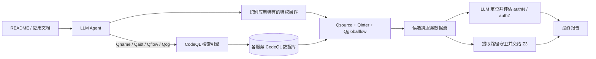
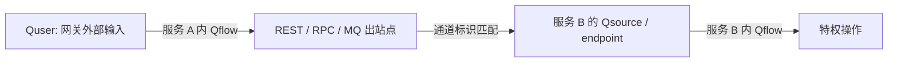
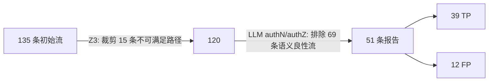

## 摘要

> 论文主题：将 LLM 的语义推理能力与 CodeQL 的静态程序分析能力结合，用于检测多语言微服务中的权限提升漏洞。
>
> 核心判断：NEO 在 SAST 上增加了一层面向 Agent 的窄接口。CodeQL 负责回答“代码结构和数据流上可能发生什么”，LLM 负责判断“这个操作在业务上是否敏感、现有授权是否足够”。

## 论文要解决的问题

微服务的权限检查通常跨越多个函数和服务。一次危险操作可能经历：网关接收外部输入、Java 服务校验 JWT、通过 REST/gRPC/Kafka 调用另一服务、Python 服务修改角色或订单状态。特权操作、认证和授权可能分别位于控制器、装饰器、ACL、过滤器、依赖注入组件或配置文件中。

论文将困难归纳为三个问题：

1. **跨服务、跨语言的数据流不可见。** 单个服务的调用图无法呈现端到端权限执行逻辑，语言之间也没有统一 AST 或调用关系。
2. **特权操作依赖业务语义。** 数据库写入、文件访问容易列举，但“确认付款”“分配优惠券”“切换租户”“修改角色”等操作只有结合应用功能才能认定为敏感。
3. **安全检查的实现形式高度分散。** 找到 `authz()` 还不够，还要理解它检查的是登录状态、角色、具体权限，还是当前用户对目标资源的所有权。

以论文的 Java 鉴权、Python 赋权示例为例：传统分析需要同时理解 Java 入口、跨服务 URL、Python 路由依赖 `Depends(authz)`、`switch_roles()` 对目标角色的约束，以及最终的 `update_role()` 数据库更新。NEO 因而围绕四步展开：代码搜索、特权操作识别、跨服务流拼接、认证与授权验证。



## 代码搜索引擎与传统 SAST

### 传统 SAST 为什么看起来像“写死的逻辑”

传统 SAST 把相对稳定的知识固化在不同层次中，同一套分析器可以处理许多代码库：

| 层次 | 固化的内容 | 面向新代码库时复用的部分 |
| --- | --- | --- |
| 语言提取器 | 语法、名称绑定、类型、控制流 | 同一语言的任意项目 |
| 通用分析算法 | 调用图、数据流、污点传播、别名近似 | 大多数项目共享 |
| 框架/库模型 | 请求参数、数据库 API、序列化、净化函数 | 使用主流框架的项目共享 |
| 漏洞查询 | source、sink、barrier 和危险关系 | 同类漏洞共享 |
| 项目定制 | 私有封装、业务权限、特殊协议 | 只在必要时补充 |

工程中固化的内容通常是稳定的 API 契约，例如“某个限定名称的方法的第 0 个参数是 SQL 查询”“某个注解标记 HTTP 入口”。具体仓库的文件名和调用链会由提取器转换成关系事实，通用规则再对这些事实求解。因此，少量成熟模型可以覆盖大量使用相同语言和框架的代码库。

这种设计继承了传统 SAST 的目标：查询必须可复现、可审计、可批量运行，专家还应当能为特殊框架补模型。代价是复杂性被转移给查询作者。普通安全工程师可以复用现有规则，但开发新规则时必须理解语言库、类型层次、数据流配置、框架模型与结果元数据。

### Joern 和 CodeQL 的查询方案

二者都把程序转换为可查询的结构，但底层抽象不同。Joern 采用代码属性图，CodeQL 采用关系数据库与类型化查询库。

| 工具 | 程序表示 | 查询方式 | 典型心智模型 |
| --- | --- | --- | --- |
| Joern | Code Property Graph（CPG），融合 AST、CFG、调用图和数据依赖图 | CPGQL，接近 Scala 的图遍历 DSL | 从节点出发，沿边遍历、过滤，再取属性 |
| CodeQL | 由语言提取器生成的关系数据库 | QL，带类型、类、谓词和模块的关系/逻辑查询语言 | 声明满足若干关系的所有结果 |

Joern 查询通常从 `cpg` 开始，连续组合节点类型、遍历步骤、过滤器和属性：

```scala
// 查找名为 updateRole 的调用及其实参
cpg.call.name("updateRole").argument.code.l

// 从 setUserRole 方法查看其调用的方法
cpg.method.name("setUserRole").callee.name.l
```

CodeQL 则更像“对程序关系做查询”：

```ql
import java

from MethodAccess call
where call.getMethod().getName() = "updateRole"
select call, call.getLocation()
```

Joern 的优势是图遍历直观，适合交互式探索；CodeQL 的优势是类型化查询、成熟语言库、跨过程数据流和安全查询生态。NEO 选择 CodeQL 作为后端，但论文也明确指出，代码搜索原语可以在 Joern 等其他分析后端上实现。

### 为什么说语法空间与 API 接口面过于庞大

这里的“庞大”指 Agent 必须在大量 API 和语义选项构成的组合空间中作出正确选择：

- 语言专属 AST 类：Java 调用是 `MethodAccess`，Python 是 `Call`，JavaScript 是 `CallExpr`；
- 大量类、谓词、模块、遍历步骤和属性方法；
- 局部/全局数据流、值流/污点流、source/sink/barrier/summary 等不同配置；
- 静态调用、虚分派、重写方法、动态目标等不同调用图谓词；
- 各语言和框架的限定名称、参数位置、类型层次与库模型；
- 查询输出元数据、路径节点和告警格式的约束。

因此，让 LLM 临时生成完整 CodeQL 查询会遇到多类问题。除了语法错误，它还可能选错 AST 类型、把局部流当成全局流、遗漏动态分派、错误配置 source/sink，或返回无法用于路径展示的结果。论文的消融实验也验证了这一点：去掉搜索原语、让 LLM 直接写 CodeQL 后，只检出 2/42 个漏洞。

NEO 的解决办法是将庞大的后端接口压缩成少量、参数稳定的 Agent API。这类似编译器中的中间表示：不同语言仍由各自模板处理，但 Agent 只面对共同语义。

### 四种基本代码搜索原语

作者手工分析了 290 条 CodeQL 安全查询，发现四类操作已覆盖绝大部分查询需求：

| 原语 | 含义 | 在 290 条查询中的出现比例 | 典型用途 |
| --- | --- | ---: | --- |
| `Qname` | 按名称或正则查找元素 | 98.6% | 搜索 `update.*`、注解、敏感 API |
| `Qast` | 按 AST 类型或结构查找 | 73.8% | 方法、调用、字段/属性访问、赋值 |
| `Qflow` | 服务内数据流追踪 | 70.7% | 参数是否能传播到调用点或写操作 |
| `Qcg` | 调用图遍历 | 49.7% | 查 callers/callees，定位包装层和检查逻辑 |

配套属性函数包括：

- `getLocation()`：返回文件、行、列；
- `getSource()`：返回目标语句、函数或相关代码切片；
- `getType()`：返回元素类型或推断类型。

`rg` 返回文本命中，无法稳定地区分注释、字符串和真正的函数调用。`Qname` 返回程序元素，结果还可以继续用于类型查询、调用图遍历或数据流分析。NEO 仍保留 Bash 命令作为回退工具，主流程依靠结构化结果减少上下文噪声。

### CodeQL 的 AST、流追踪与调用图是怎样实现的

CodeQL 的整体开发链条可以概括为：

1. **语言提取器建库。** 编译型语言通常监视构建过程并结合编译信息，解释型语言直接解析源码。提取器记录 AST、符号解析、类型、控制流等事实。
2. **标准库封装事实。** `.qll` 库将底层关系包装成 `Expr`、`Stmt`、`MethodAccess`、`Callable` 等可组合对象。
3. **通用算法计算关系。** 数据流库构造节点与传播边，调用图库解析直接目标并保守近似动态目标。
4. **安全查询声明问题。** 查询作者配置 source、sink、barrier、额外传播步骤与库摘要，再选择应报告的路径。

AST 查找本质上是确定性关系查询。例如“调用名为 `updateRole` 的位置”直接筛选已提取的调用节点。它不需要推测某次运行会发生什么，因此通常比数据流和调用图稳定。

数据流先建立传播关系。概念上可写为：

$$
E_{flow}=E_{assign}\cup E_{parameter}\cup E_{return}\cup E_{summary}\cup E_{additional}
$$

其中包括赋值、实参与形参、返回值、库函数摘要以及查询作者补充的传播步骤。值流要求语义上的值保持，污点追踪还允许编码、拼接等非值保持但“影响关系”仍存在的步骤。全局数据流再对这些边做跨过程可达性求解。

调用图的直接调用较容易解析；接口、继承和虚方法调用必须求“可能目标”。CodeQL 中类似 `polyCalls` 的谓词会将所有静态上可能的重写实现纳入结果：

```ql
from Callable caller, Callable callee
where caller.polyCalls(callee)
select caller, callee
```

这体现了传统 SAST 的基本取舍：宁愿保留一个暂时无法排除的候选，也不要因为猜错运行时目标而直接漏掉漏洞。

## 查找特权操作

论文将特权操作定义为以下三类调用点：

1. 访问敏感资源，如用户私有记录、配置、文件；
2. 执行安全关键动作，如数据库写入、系统命令；
3. 修改受保护状态，如权限、令牌、角色、付款和订单状态。

传统规则容易列出通用 sink，却难以穷举应用特有的业务操作。NEO 首先阅读 README 等自然语言材料理解系统功能，再由 LLM 生成名称/AST 查询，例如 `Qname(service, "update.*")`。每个命中都通过 `getSource()` 读取实现并二次判断，必要时继续生成新的关键词。

函数名只负责召回候选。LLM 还要结合操作对象、状态变化、调用上下文和数据流作出判断。例如，`paySuccess()` 的实现会把订单支付状态写为成功，这项状态修改构成了特权操作。

该过程仍有两个边界：

- 语义判断是概率性的，可能把客户端合法功能误认为服务端危险操作；
- 非常规 API、间接包装或动态调用可能使候选根本没有被 CodeQL 搜索到，此时 LLM 无从判断。

## 识别跨服务数据流

### 三个跨服务原语

- `Qsource(service)`：查找某个服务接收不可信数据的位置，包括 HTTP 参数、消息消费者和 API 端点。
- `Quser`：`Qsource` 的特殊子集，只表示整个系统真正暴露给外部用户的入口，通常位于网关或代理。
- `Qinter(service)`：查找出站 HTTP、RPC、Kafka、RabbitMQ、WebSocket、GraphQL 等服务间通信点，并提取 URL、topic、RPC 方法等通道标识符。
- `Qglobalflow(source, sink)`：将服务内 `Qflow` 和服务间通道边拼成全局可达性图。

必须区分 `Qsource` 与 `Quser`：下游服务的 REST 端点或 Kafka consumer 是该服务的 source，却不一定由外部攻击者直接访问。只有从 `Quser` 出发还能走到该端点，才构成完整攻击面。

### MScan 到底怎样识别用户输入源

NEO 复用了 MScan 的核心入口识别思想，但不能简单概括为“读取 `web.xml`”。MScan 面向微服务网关配置，其方法是：

1. 定位 API Gateway 的配置文件；
2. 向 LLM 提供任务说明、少量“配置 → 路由”示例和实际配置；
3. 让 LLM 输出真正会转发请求的路由正则列表，并理解 `SetResponseStatus=403`、`Denied` 等阻断过滤器；
4. 静态分析所有服务，提取端点 URI；
5. 用网关路由正则匹配端点 URI；
6. 只有匹配成功、实际暴露到网关的端点参数才成为外部用户 source。

因此，它是“**LLM 解析网关配置 + 静态提取端点 + 路由匹配**”的混合方法。XML 当然可以作为配置载体，但 MScan 论文中的核心对象是 Spring Cloud Gateway、Zuul、APISIX 等网关路由，而非专门依赖 Java Servlet 的 `web.xml`。

MScan 的实验中，4,611 个服务端点有 1,454 个并未暴露给外部用户，约占 31%。若不做入口识别、把所有端点都当 source，精确率会从 71.95% 降到 39.86%。这个结果说明，微服务污点分析首先需要区分服务内入口与系统外部入口。

NEO 的 `Quser` 沿用了这一思想：让 LLM 解释网关配置，确定整个系统的外部用户输入。服务内部的 `Qsource` 则继续用于跨服务拼接。

### 算法 1 的自然语言含义

算法 1 构造一张**全局可能可达图**。输入是服务集合 $S$ 和已经识别的特权操作集合 $P$，输出是图 $G$。这张图只用于生成候选路径，无法直接证明漏洞成立。

第一阶段在每个服务内部做摘要：

1. 枚举该服务的所有输入点 `Srcs = Qsource(s)`；
2. 取出位于该服务中的特权操作 `PrivOps`；
3. 找出该服务的所有出站通信点 `InterCalls = Qinter(s)`；
4. 对每个 source，检查它能否在服务内流到某个特权操作或出站通信点；
5. 若 `Qflow` 返回非空路径，就在全局图中加入一条摘要边。

第二阶段跨越服务边界：

1. 对图中的每个服务间调用 $c:s_1\rightarrow s_2$；
2. 根据 URL、topic、RPC 方法等通道标识找到 $s_2$ 的目标 endpoint；
3. 加入“出站调用 $c$ → 目标 endpoint”的跨服务边。



例如，Java 服务中的角色参数流到 `/setUserRole` HTTP 调用，Python 服务的 `/setUserRole` 参数又流到 `update_role()`。第一阶段分别得到两条服务内边；第二阶段把 Java HTTP 调用与 Python endpoint 接上，最终形成：

$$
user\rightarrow role\rightarrow REST\ call\rightarrow Python\ endpoint\rightarrow update\_role
$$

此路径只说明“攻击者输入可能影响特权操作”。它尚未回答路径是否真实可执行，也没有回答沿途授权是否充分，这正是第 4 步验证的任务。

## 验证候选数据流

### 定位并评估 authN/authZ

NEO 沿候选路径逐节点检查装饰器、中间件、依赖注入和内联条件。系统按需调用 `Qname`、`Qflow`、`Qcg`、`getSource()` 获取函数签名、调用关系或小型代码切片，从而避免一次读取整个仓库。

验证分为两个问题：

- **authN：调用者是谁？** 例如 JWT 是否有效、会话是否存在。
- **authZ：该调用者能否对这个对象执行这个动作？** 可能是角色、权限、租户边界或资源所有权检查。

只找到 `authz()` 这个名字不能证明授权充分。LLM 还要读取实现，判断它究竟只验证了登录，还是检查了管理员角色；即使检查了某个角色，也要判断该特权操作是否需要更细的所有权约束。论文要解决的正是“已有检查”与“操作实际所需策略”之间的语义差距。

### 代码怎样转换为 SMT 约束

论文没有把全部代码、调用图和数据流翻译成数学公式。实际流程是：

1. CodeQL 先给出一条可能的数据流路径；
2. LLM 只遍历该路径上的分支节点；
3. 根据路径选择的分支收集 guard，走 `else` 分支时对条件取反；
4. 把变量、常量和 guard 翻译为 SMT-LIB；
5. Z3 检查这些条件的合取是否可满足。

对于候选路径 $\pi$，其抽象路径条件为：

$$
\Phi_{\pi}=\bigwedge_{i=1}^{n}g_i
$$

若 Z3 返回 `unsat`，说明不存在同时满足所有已编码 guard 的输入，这条抽象路径不可行，可以裁剪。若返回 `sat`，则存在一个满足抽象约束的赋值。该结果无法说明漏洞可利用，也无法说明授权缺失。

例如，静态数据流可能把下面两个互斥分支拼成一条路径：

```python
if x == 0:
    y = user_input

if x != 0:
    privileged_operation(y)
```

对应约束是：

```lisp
(declare-const x Int)
(assert (= x 0))
(assert (not (= x 0)))
(check-sat)
```

Z3 返回 `unsat`，所以这条候选流是静态过度近似造成的伪路径。

### 这里能“证明”什么，不能证明什么

| 结果 | 可以得出的结论 | 不能得出的结论 |
| --- | --- | --- |
| `unsat` | **已编码的路径条件**相互矛盾 | 整个程序安全、所有其他路径不可达 |
| `sat` | 抽象条件存在一个模型 | 真实环境可到达、漏洞一定可利用 |
| LLM 认定 authZ 不足 | 结合当前上下文存在策略缺口 | 形式化证明了设计者的真实安全策略 |

NEO 在这里执行轻量级路径敏感裁剪，整程序符号执行和形式化验证不在该步骤的范围内。证明的有效性依赖约束抽取是否忠实、变量关系是否完整、框架语义是否建模。论文也承认 LLM 可能生成无效或不完整的 SMT-LIB；若多层数据依赖过于复杂，系统会跳过该步骤并保留候选。

## 实现

NEO 原型包含约 5.8K 行 CodeQL 与 4.3K 行 Python，支持 Go、Java、JavaScript、Python、C#、C 和 C++ 七种语言。论文提供了公开实现与提示词：[columbia/neo](https://github.com/columbia/neo)。

主要实现工作如下：

1. **代码数据库构建。** 每个应用构建一次 CodeQL 数据库，保存 AST、CFG、数据流和调用关系。
2. **Agent 编排。** Python 循环维护当前分析状态，让 LLM 决定下一次搜索、上下文读取或验证动作；无新特权操作、所有流已验证或达到迭代上限时停止。
3. **通信通道识别。** 从通信调用点反向追踪 URL、topic 或常量，支持 REST、gRPC stub、Kafka、RabbitMQ、WebSocket 和 Dubbo。
4. **搜索原语模板。** 每种语言用独立 CodeQL 模块实现，Python 只填充方法名、类型等占位符。例如统一的“方法调用”在 Java/Python/JavaScript 后端分别映射到 `MethodAccess`、`Call`、`CallExpr`。
5. **SMT-LIB 生成。** 提示 LLM 声明变量和状态常量，收集 `if`、`switch` 等路径谓词，再调用 Z3。

这里的语言无关限定在 **Agent API** 层。底层分析仍然存在语言差异，NEO 将这些差异封装进 5.8K 行 CodeQL 模板。新增语言或框架仍要依赖 CodeQL 支持并开发相应模型。

## 效果评估

### 数据集与实验设置

数据集分为 21 个真实微服务组成的评估语料库，以及包含 20 个已验证漏洞的真值数据集。两者合计 25 个应用。

| 应用 | Star 数 | 代码行数 | 语言 |
| --- | ---: | ---: | --- |
| light-reading-cloud | 1,465 | 6,394 | Java |
| PiggyMetrics | 13,757 | 19,942 | JS, Java |
| Pitstop | 1,145 | 96,576 | JS, C# |
| SiteWhere | 1,034 | 40,764 | Java |
| Supermarket | 2,087 | 167,169 | Java |
| Food Delivery | 941 | 178,063 | JS, C# |
| Online Boutique | 19,254 | 31,179 | JS, Java, Go, Python, C# |
| Booking | 1,256 | 34,974 | JS, C# |
| Hotel Map | 1,085 | 2,696 | Go |
| JBone | 1,008 | 12,360 | Java |
| Train Ticket | 836 | 344,119 | JS, Java, Go, Python |
| Mall4cloud | 5,933 | 116,043 | JS, Java |
| AspnetRun E-Shop | 3,121 | 62,105 | C# |
| Cinema | 1,773 | 8,152 | JS |
| TODO App | 1,409 | 16,240 | JS, Java, Go, Python |
| ABP eShopOnAbp | 736 | 220,134 | JS, C# |
| Spring Boot Basics | 728 | 5,046 | JS, Java |
| Magda | 564 | 625,045 | JS, Java |
| Genie | 1,756 | 127,889 | JS, Java, Python |
| DeathStarBench | 871 | 3,621,236 | JS, C, C++, Go, Python |
| Swarm | 12,673 | 133,793 | Java |

真值数据集包含 18 个已公开漏洞，并在评估期间由 NEO 于 Newbee Mall 额外发现 2 个漏洞，共 20 个：

| 应用 | Star 数 | 代码行数 | 语言 | 漏洞数 |
| --- | ---: | ---: | --- | ---: |
| Newbee Mall | 11,437 | 172,057 | Java | 11 + 2 |
| ZLT Platform | 4,721 | 36,950 | Java, JS | 3 |
| Armeria | 5,033 | 633,902 | Java, JS | 2 |
| Spring-cloud-dataflow | 1,138 | 235,572 | Java, JS, Python | 2 |

默认模型为 Claude 3.7 Sonnet，温度 0.2，每个应用最多分析 10 小时；两个 few-shot 漏洞示例来自评估集外。所有报告都由作者人工检查，并构造 PoC 验证可利用性。

### 总体效果

| 数据集 | TP | FP | FN | 精确率 | 召回率 |
| --- | ---: | ---: | ---: | ---: | ---: |
| 评估语料库 | 22 | 8 | N/A | 73.3% | N/A |
| 真值数据集 | 17 | 4 | 3 | 81.0% | 85.0% |
| 合计 | 39 | 12 | N/A | 76.5% | N/A |

39 个真阳性中有 24 个此前未知：评估语料库 22 个，真值应用中新发现 2 个。漏洞影响包括 SQL 注入、任意文件读写、路径遍历、角色/权限提升、管理配置修改，以及付款和订单履行等业务逻辑操作。其中 18 个涉及应用特有的特权操作，说明只维护一份通用 sink 列表远远不够。

12 个误报的根因很集中：

- 8 个混淆了客户端与服务端执行环境，例如浏览本地目录以上传文件、显示用户自己控制的内容；
- 4 个没有找到实际存在的 authN/authZ，例如检查位于外部服务或配置文件中。

3 个漏报分别来自：非常规 API 模式导致特权操作未识别；特权操作已找到但数据流缺失；未建模 Spring matrix variable 的 URL 规范化语义。CVE-2023-38493 中，请求 `/important;a=b/resources` 会被 Spring 规范化为 `/important/resources`，但装饰器的原始路径匹配可能未保护它。NEO 看到了认证装饰器，却没有理解框架内部对分号路径参数的处理。

### 组件消融

消融研究以两个数据集中的 42 个漏洞为全集：24 个新漏洞加 18 个已知漏洞。

| 变体 | TP | FP | FN | 精确率 | 召回率 |
| --- | ---: | ---: | ---: | ---: | ---: |
| NEO-basic-sink | 14 | 0 | 28 | 100.0% | 33.3% |
| NEO-no-queryop | 2 | 0 | 40 | 100.0% | 4.8% |
| NEO-no-odctx | 27 | 31 | 15 | 46.6% | 64.3% |
| NEO | 39 | 12 | 3 | 76.5% | 92.9% |

- 只保留通用 sink 时召回率降到 33.3%，证明应用特有特权操作是主要增益来源。
- 让 LLM 直接生成 CodeQL 时召回率仅 4.8%，大量查询存在语法或 API 使用错误。窄接口直接决定了系统能否稳定调用静态分析能力。
- 只允许一次性取上下文时，误报和漏报同时增加。授权机制可能散布在多层调用、装饰器和配置中，必须边搜索边决定下一步所需证据。

### 搜索原语为什么会返回“不精确结果”

作者只在 PiggyMetrics 上做了这项人工审计：记录 132 次不同的原语执行，从 `Qname`、`Qast`、`Qflow`、`Qcg` 各抽 5 次，共检查 20 次。因此“7/20 不精确”是一个小规模分层抽样结果，不应解释为所有查询有 35% 错误率。

论文中的“不精确”主要指**返回了正确关系的超集**。这些结果包含有效关系，也包含额外候选。设真实运行时关系为 $R$，静态分析结果为 $A$，过度近似可写为：

$$
R\subseteq A
$$

多出来的 $A-R$ 就是不一定在真实运行中出现的候选边。

最典型的来源是虚分派：接口变量可能在运行时指向多个实现，依赖注入、工厂、运行配置和反射又会影响具体对象。CodeQL 无法静态确定唯一目标时，`polyCalls` 等谓词会保守地加入所有类型兼容的实现。

这种误差对两类原语的表现不同：

- `Qcg` 得到多余的 caller/callee 边，Agent 可能阅读实际上不会执行的方法；
- `Qflow` 基于调用图继续传播，额外调用边会产生额外数据流；此外，分支相关性、别名、上下文敏感度和库摘要也会产生伪路径。

`Qname` 和 `Qast` 在这 20 次抽样中没有出现不精确结果。它们主要查询直接提取的语法/索引事实，不需要推断运行时目标。该结论只适用于本次抽样，无法外推到所有项目。

论文还报告 5/20 次查询存在**结果缺失**，同样集中于 `Qflow` 和 `Qcg`，根因是复杂控制流或隐式依赖没有被模型覆盖。过度近似容易增加误报，缺失则会造成漏报；静态分析必须在二者之间权衡。可行的改进包括更精确的 points-to/type 约束、框架依赖注入和反射模型、更强的上下文敏感分析及路径条件，但都会增加运行时间和内存。

论文没有公布 7 个不精确实例和 5 个缺失实例的逐条分解，只明确举了虚分派示例。因此不能把全部错误都归因于 `polyCalls`。

### 两种验证策略的贡献

跨服务分析最初得到 135 条用户输入到特权操作的候选流：



Z3 对 28 条适合形式化的流生成了语法有效的 SMT-LIB，其中 15 条被证明不可满足，占初始流 11.1%；作者人工确认这 15 条均为真阴性。随后 LLM 授权验证又排除 69 条语义上良性的流。两步合计排除 84/135 条潜在误报，即 62.2%。

作者只随机人工审计了 69 条 LLM 排除结果中的 10 条，这 10 条判断均正确。它能支持“抽样中未发现错误”，不能证明 69 条全部正确；论文因此建议用 human-in-the-loop 审查 LLM 给出的理由。

### 模型、温度与提示策略

论文测试 Claude 3.7 Sonnet、Gemini 2.5 Flash 和 GPT-5 mini，温度从 0 到 1。总体规律是：

- $T\leq0.2$ 更遵循已有安全模式，精确率较高，但可能错过多步逻辑漏洞；
- $T\in[0.4,0.6]$ 允许更多探索，某些模型召回率提高；
- $T\geq0.8$ 幻觉和把良性逻辑标为漏洞的情况显著增加。

提示策略的消融结果如下：

| 提示策略 | TP | FP | 精确率 | 召回率 |
| --- | ---: | ---: | ---: | ---: |
| Few-shot + 分步工作流 | 17 | 4 | 81.0% | 85.0% |
| Zero-shot | 14 | 6 | 70.0% | 70.0% |
| 直接输出、无分步工作流 | 11 | 9 | 55.0% | 55.0% |

这里更稳妥的解读是：示例和结构化中间步骤帮助模型把搜索证据落到具体安全判断上。结果不能直接外推到所有模型、提示或数据集，因为敏感性实验只在较小的真值数据集上运行。

## 与基线方法比较

比较集合取所有工具发现漏洞的并集，共 44 个漏洞。该集合没有经过预先穷举，完整性无法得到保证。因此，表中主要比较 TP、FP 和精确率，不报告严格召回率。

| 方法 | TP | FP | 精确率 |
| --- | ---: | ---: | ---: |
| MScan* | 8 | 3 | 72.7% |
| MScan* + NEO Sinks | 16 | 7 | 69.6% |
| CodeQL* | 7 | 6 | 53.8% |
| EnIGMA | 15 | 14 | 51.7% |
| NEO | 39 | 12 | 76.5% |

星号表示作者把 NEO 的后处理验证接到基线原始结果上。经过统一验证的结果更适合比较各工具的数据流发现能力。

### MScan

MScan 只支持 Java。MScan* 检出 8 个漏洞；用 NEO 识别的应用特有 sink 替换通用 sink 后增至 16 个。NEO 在同一批 Java 微服务中找到 19 个。MScan*+Sinks 唯一找到而 NEO 漏掉的是 CVE-2023-38493，因为 MScan 的路径模型包含 Spring matrix variable 规范化。

### CodeQL

CodeQL* 对每个服务独立运行默认 critical 安全查询，没有跨服务权限提升模型，因此只检出 7 个，且都被 NEO 覆盖。通用查询套件没有定义 NEO 所需的“应用特有特权操作 + 跨服务通道 + 授权充分性”问题，这项实验主要反映查询任务和建模范围的差异。

### EnIGMA

EnIGMA 依赖 `grep`、`find` 和文件读取让 LLM 自行探索。 DeathStarBench 的一条流可跨越 35 个以上函数，大量无关源码容易耗尽上下文并使分析提前终止。NEO 的结构化搜索可以直接返回路径相关节点，因此找到更多漏洞。

但 EnIGMA 找到 2 个 NEO 漏掉的 JavaScript 漏洞：动态函数调用使 CodeQL 无法构造完整数据流，候选从未进入 NEO 的 LLM 验证阶段；EnIGMA 直接阅读源码，反而有机会通过自然语言推理发现它们。该结果揭示了混合系统的硬边界：后端静态分析若没有召回候选，前端 LLM 再强也无法补救。

## 效率、扩展性与案例

### 效率和成本

NEO 分析 25 个应用共耗时 38.9 小时，平均每个应用 1.6 小时，LLM API 成本约 18 美元。EnIGMA 平均为 3.4 小时和 25 美元，且更容易因上下文耗尽而提前停止或重复探索。

该结果证明结构化检索能降低 Agent 阅读代码的成本，但“平均 18 美元可用于真实部署”仍取决于模型价格、增量分析能力和 CI 运行频率。当前 NEO 每次面向整个应用构建和分析，尚未展示持续集成中的增量成本。

### 扩展到普通应用与其他漏洞类型

移除微服务假设、修改提示中的程序背景后，NEO 在普通 Python/Java 应用中发现 11 个新权限提升漏洞，其中 5 个获确认、2 个修复。

将 prompt 中的 source、sink、sanitizer 改为注入漏洞定义后，系统在 JavaScript 应用/包中发现 5 个命令注入和 2 个 SQL 注入，其中 2 个获开发者确认。可复用的是“Agent 规划 + 结构化代码搜索 + 路径验证”骨架；不同漏洞类型仍需重新定义语义目标和净化条件。

### Newbee Mall 案例

`paySuccess(orderNo, payType)` 接收订单号，确认订单存在且状态为 `ORDER_PRE_PAY` 后，直接把订单标为已付款。它没有检查订单是否属于当前登录用户，因此任意已认证用户都能把他人的订单标记为付款成功。

NEO 的发现过程是：

1. 结合应用语义，用 `Qast`/`Qname` 找到付款状态更新并认定其为特权操作；
2. 追踪从 HTTP endpoint 到订单更新的数据流；
3. 搜索 authN/authZ，发现只有订单状态检查，没有所有权检查；
4. 按需检索同文件的 `cancelOrder()`，发现该方法存在 `order.getUserId().equals(currentUser.getId())`，用相邻安全实现反证 `paySuccess()` 缺少必要检查。

这个案例体现了 LLM 的真正价值：CodeQL 能证明 `orderNo` 流到订单更新，却无法仅凭通用规则推断“付款操作必须检查订单所有者”；相邻方法中的检查模式为意图推断提供了强证据。

### 负责任披露

论文将 §6.2 与 §6.6 合计的 42 个新漏洞报告给维护者；投稿时 18 个获确认，8 个已修复。论文结论中的“24 个零日权限提升漏洞”只指主微服务评估，不应与扩展性实验的新增发现混为一谈。

## 局限性、相关工作与个人理解

### 论文承认的局限性

1. **继承 CodeQL 的可见性边界。** 动态调用、反射、指针别名和语言模型质量会影响调用图与数据流；支持语言也受 CodeQL 限制。
2. **配置文件缺乏结构化语义分析。** YAML、JSON、XML 中可能存在路由和访问控制规则，NEO 主要依靠 LLM 在检索到它们后解释。若文件没有进入上下文，配置型漏洞可能漏报。
3. **真实部署环境不可见。** 环境变量、网关部署、服务网格和云 IAM 等运行时配置通常无法从第三方源码审计中完整恢复，因此配置错误型提权不在当前范围内。
4. **LLM 判断具有随机性。** 特权操作识别和授权充分性属于概率性结论，需要人工复核理由与 PoC。
5. **静态分析仍在精度/召回间取舍。** 过度近似会产生候选噪声，缺失的动态边则会让 LLM 完全看不到漏洞。

作者提出的后续方向包括：更好地区分客户端/服务端上下文；结合动态测试和欠约束符号执行生成 PoC；使用增量分析支持 CI；以及改进底层 CodeQL 谓词和框架模型。

### 与相关工作的关系

- MScan 解决 Java 微服务的跨服务污点流，但不推断应用业务权限策略；
- MACE、RoleCast、PCFinder、MOCGuard、MPChecker 等工作用角色、凭据命名、所有权或日志等启发式方法逼近应有权限策略；
- IRIS 用 LLM 推断 source/sink 并增强 CodeQL；LLMxCPG 让 LLM 验证程序切片；LLMSA 把分析拆为较小属性检查；
- RepoAudit、EnIGMA 等 Agent 更依赖自然语言读取与代码导航；
- NEO 的位置是用 SAST 提供结构化、可扩展的证据骨架，再让 LLM 对应用特有策略做推断。

### 对传统 SAST 设计思想的理解

NEO 重新分配了 LLM 与规则分析之间的工作：

| 问题 | 更适合的组件 | 原因 |
| --- | --- | --- |
| 某调用位于何处、参数如何传播 | CodeQL | 结构化、可复现、可扩展 |
| 某动态目标是否一定执行 | 静态分析近似 + 后续验证 | 仅看源码通常无法唯一确定 |
| `paySuccess` 是否属于敏感业务操作 | LLM + 应用文档/上下文 | 依赖自然语言和业务语义 |
| 登录检查是否足以保护订单付款 | LLM + 相邻安全实现 | 依赖预期策略和对象所有权 |
| 一组分支条件能否同时成立 | Z3 | 可给出严格的 SAT/UNSAT 结论 |

传统 SAST 的优势是“把稳定知识写死”，NEO 的增量是“让不稳定、应用特有的部分按需推理”。四个搜索原语是二者之间的接口：它们牺牲部分查询自由度，换取 Agent 调用的稳定性、跨语言一致性与上下文效率。

从这个角度看，NEO 更像一个分层系统：

$$
\text{漏洞结论}=\text{静态结构证据}+\text{业务安全语义}+\text{路径可满足性过滤}+\text{人工/PoC 验证}
$$

各层功能互补。CodeQL 的“may-flow”只表示潜在数据流，LLM 输出的是语义判断，Z3 的 `sat` 只表示抽象约束可满足。论文把这些能力组织成可迭代、可按需取证的 Agent 工作流。

## 总结

NEO 的主要创新在于面向 Agent 重新设计程序分析接口。`Qname/Qast/Qflow/Qcg` 压缩了 CodeQL 的巨大查询空间，`Qsource/Qinter/Qglobalflow` 连接跨语言服务，LLM 识别特权操作与授权语义，Z3 排除一部分不可行路径。

实验显示这一组合显著优于让 LLM 直接读仓库或直接写 CodeQL，也优于仅使用通用 sink 的传统方案。它仍然依赖底层静态分析的召回、框架模型和 LLM 的上下文判断。NEO 适合作为大型多语言系统的审计候选生成器，能够提供高质量的结构证据，并把人工精力集中到需要业务判断的部分。
